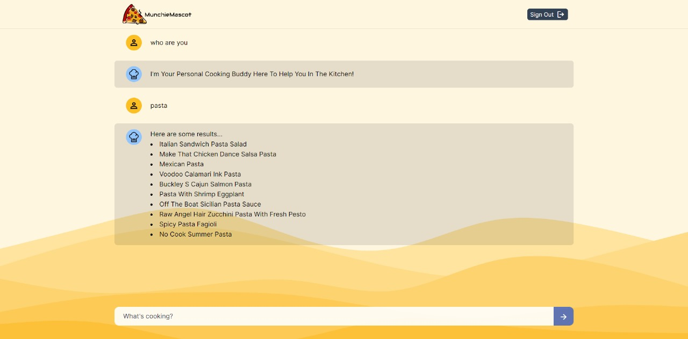
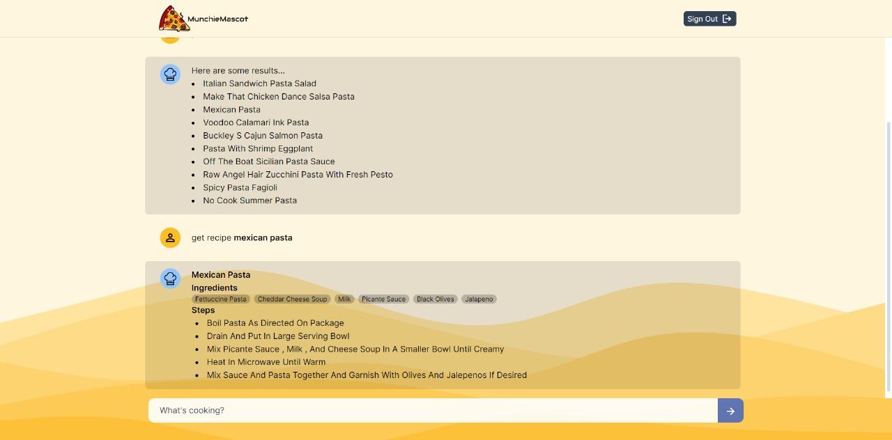
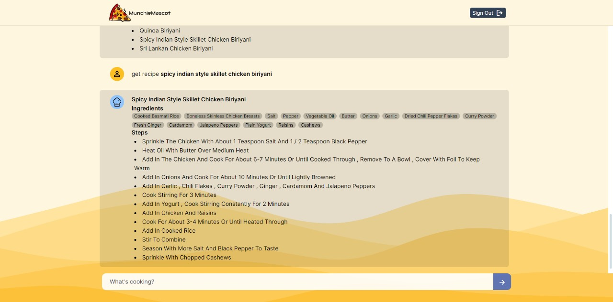
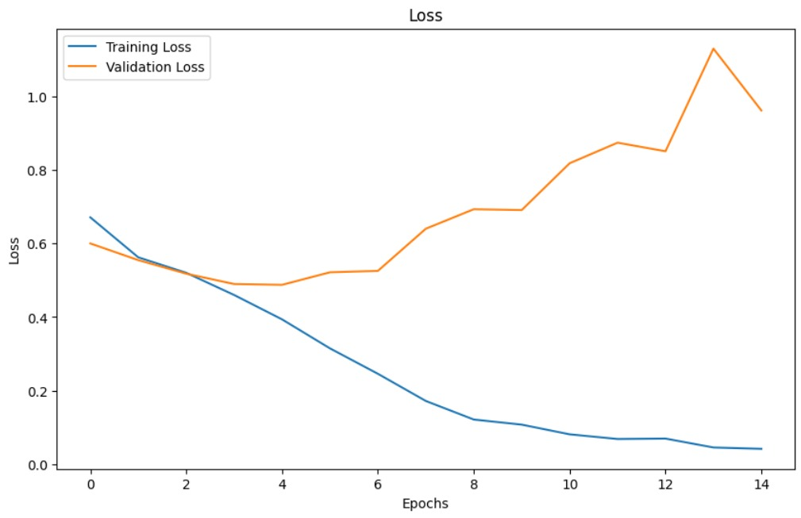
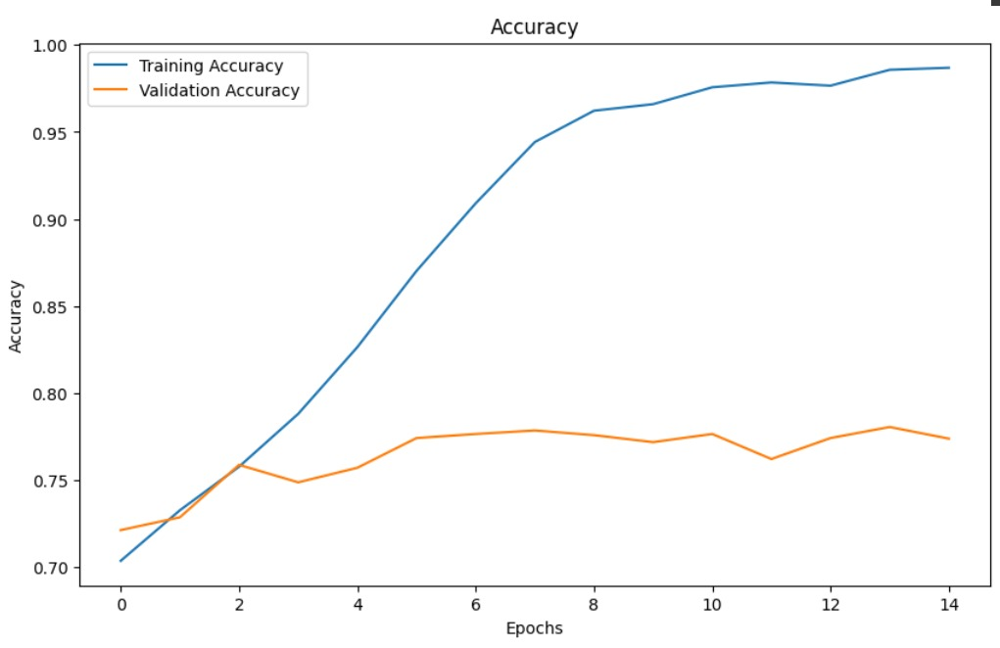

# MunchieMascot
Your personal culinary AI-chatbot

#Writeup
--------
MunchieMascot is an end-to-end chatbot for recipe generation, developed using VS Code. It utilizes the RAW_recipes.csv dataset from Kaggle to provide detailed and diverse recipe suggestions. The frontend, created with Vite.js, ensures a fast and modern user interface. The model was trained using GloVe embeddings (glove.6B.100d.txt) and achieved an impressive accuracy of 98%. The dataset was preprocessed by converting text to lowercase and tokenizing it, ensuring high-quality input for the model. This integration of advanced natural language processing techniques with comprehensive recipe data allows MunchieMascot to deliver tailored culinary recommendations efficiently and accurately.

## App Snapshots

## Model Training

